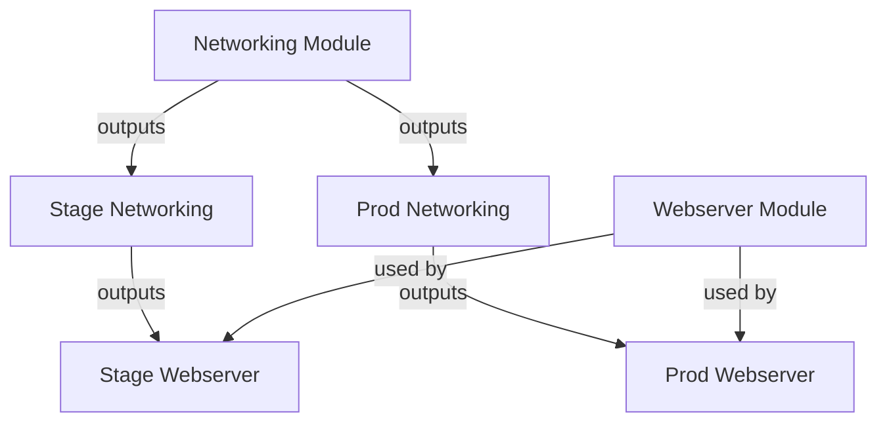

# Terraform Modular Infrastructure

This project implements a modular infrastructure design with separate networking and webserver components for stage and production environments.

## Architecture Overview



## Getting Started

### Prerequisites
- Terraform v1.0+
- AWS credentials configured (via environment variables or ~/.aws/credentials)

### AWS Credentials Setup

Ensure you have valid AWS credentials configured. You can set them using one of these methods:

1. **Environment Variables:**
   ```bash
   export AWS_ACCESS_KEY_ID="YOUR_ACCESS_KEY"
   export AWS_SECRET_ACCESS_KEY="YOUR_SECRET_KEY"
   export AWS_DEFAULT_REGION="us-east-1"
   ```

2. **AWS CLI Configuration:**
   ```bash
   aws configure
   ```
   Follow prompts to set access key, secret key, and default region

### Usage

#### Stage Environment
1. **Apply Networking Configuration:**
   ```bash
   cd stage/networking
   terraform init
   terraform apply -auto-approve
   ```

2. **Apply Webserver Configuration:**
   ```bash
   cd ../webserver
   terraform init
   terraform apply -auto-approve
   ```

3. **Verify Resources:**
   - Check AWS Console for VPC, subnets, and EC2 instances
   - Access webserver via public IP on port 8080

4. **Destroy Resources (when done):**
   ```bash
   # Destroy webserver first
   cd ../webserver
   terraform destroy -auto-approve
   
   # Then destroy networking
   cd ../networking
   terraform destroy -auto-approve
   ```

#### Orchestration Scripts (Alternative)
```bash
# Apply all resources
cd stage
./apply_networking.sh
./apply_webserver.sh

# Destroy all resources
./destroy_all.sh
```

#### Production Environment
Follow the same steps as Stage Environment, but in the `prod` directory.

### Variables
Environment-specific variables are defined in `terraform.tfvars` files within each configuration directory.

## Module Structure
- `core_modules/`: Contains reusable modules
  - `networking/`: VPC, subnets, IGW, route tables
  - `webserver/`: EC2 instances, ASG, security groups
- `stage/`: Stage environment configurations
  - `networking/`: Stage networking
  - `webserver/`: Stage webserver
- `prod/`: Production environment configurations
  - `networking/`: Production networking
  - `webserver/`: Production webserver