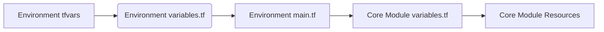

# Terraform Infrastructure Architecture (04_modules_with_vpc_and_webserver)

This document describes the architecture of the Terraform project in `04_modules_with_vpc_and_webserver`, featuring reusable core modules and environment-specific configurations.

## Directory Structure
```
04_modules_with_vpc_and_webserver/
├── .gitignore
├── README.md
├── architecture.md
├── notes.md
├── core_modules/
│   ├── networking/
│   │   ├── internet_gateway.tf
│   │   ├── outputs.tf
│   │   ├── route_tables.tf
│   │   ├── subnets.tf
│   │   ├── variables.tf
│   │   └── vpc.tf
│   └── webserver/
│       ├── main.tf
│       ├── outputs.tf
│       └── variables.tf
├── prod/
│   ├── apply_all.sh
│   ├── apply_networking.sh
│   ├── apply_webserver.sh
│   ├── destroy_all.sh
│   ├── backend.tf
│   ├── main.tf
│   ├── outputs.tf
│   ├── provider.tf
│   ├── variables.tf
│   ├── networking/
│   │   ├── backend.tf
│   │   ├── main.tf
│   │   ├── outputs.tf
│   │   ├── provider.tf
│   │   └── variables.tf
│   └── webserver/
│       ├── backend.tf
│       ├── main.tf
│       ├── provider.tf
│       └── variables.tf
└── stage/
    ├── apply_all.sh
    ├── apply_networking.sh
    ├── apply_webserver.sh
    ├── destroy_all.sh
    ├── backend.tf
    ├── main.tf
    ├── outputs.tf
    ├── provider.tf
    ├── variables.tf
    ├── networking/
    │   ├── backend.tf
    │   ├── main.tf
    │   ├── outputs.tf
    │   ├── provider.tf
    │   └── variables.tf
    └── webserver/
        ├── backend.tf
        ├── main.tf
        ├── provider.tf
        └── variables.tf
```

## Key Components
1. **Core Modules** (reusable components)
   - `networking/`: VPC, subnets, IGW, route tables
   - `webserver/`: EC2 instances, ASG, security groups

2. **Environment Configurations**
   - `stage/`: Development environment
   - `prod/`: Production environment
   - Each environment has:
     - Networking configuration
     - Webserver configuration
     - Orchestration scripts
     - Provider configuration

3. **State Management**
   - Each environment manages its own state
   - `backend.tf` in each environment directory

## Variable Flow


## Usage
```bash
# Apply stage networking
cd 04_modules_with_vpc_and_webserver/stage/networking
terraform init && terraform apply

# Apply stage webserver
cd ../webserver
terraform init && terraform apply

# Use orchestration scripts
cd ..
./apply_all.sh
```