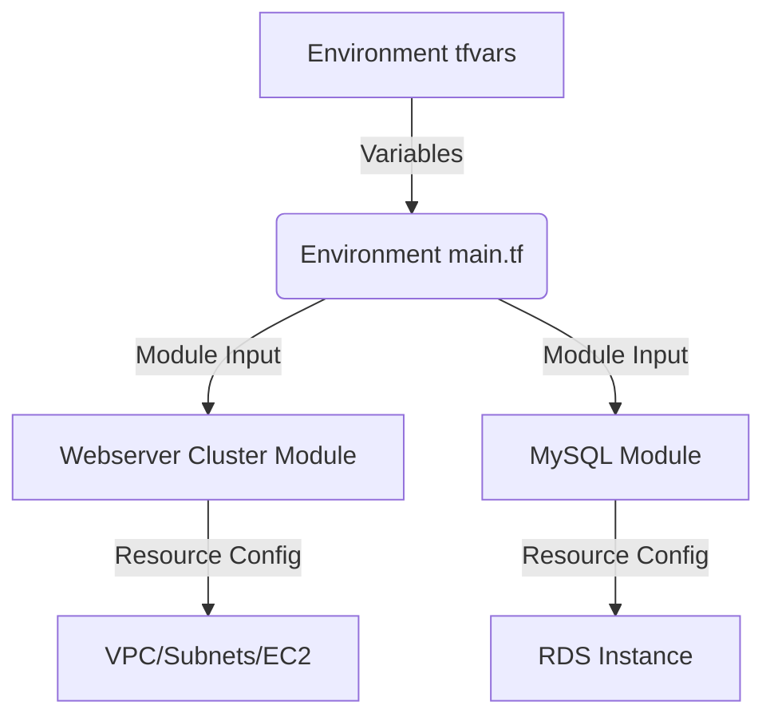
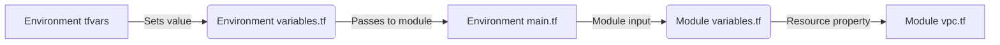

## State Management Changes

### New State Approach
- Each environment now manages its own state file at the environment root:
  - Stage: `04_modules_with_vpc_and_webserver/stage/terraform.tfstate`
  - Prod: `04_modules_with_vpc_and_webserver/prod/terraform.tfstate`
- Backend configuration is defined in environment-specific `backend.tf` files:
  ```hcl:04_modules_with_vpc_and_webserver/stage/backend.tf
  terraform {
    backend "local" {
      path = "terraform.tfstate"
    }
  }
  ```

### Key Changes:
1. **Removed database remote state**:
   - Previously: Used `data.terraform_remote_state` to access MySQL state
   - Now: Database resources are created within the same environment state
2. **State isolation**:
   - No shared state between environments
   - Each environment is fully self-contained
3. **Simplified dependencies**:
   - No cross-environment state references
   - Resources are managed within their environment's context

### Migration Steps:
1. Create state files at environment roots
2. Remove all `terraform_remote_state` references
3. Update environment configurations to use local state
4. Reinitialize Terraform in each environment:
   ```bash
   cd 04_modules_with_vpc_and_webserver/stage
   terraform init
   ```
## Environment-Specific Resources

### Key Differences Between Environments

1. **Security Group Rules**:
   - Stage environment has an additional testing rule:
     ```hcl:04_modules_with_vpc_and_webserver/stage/webserver/main.tf
     resource "aws_security_group_rule" "allow_testing_inbound" {
       type              = "ingress"
       security_group_id = module.webserver_cluster.alb_security_group_id
       from_port         = 12345
       to_port           = 12345
       protocol          = "tcp"
       cidr_blocks      = ["0.0.0.0/0"]
     }
     ```
   - This rule allows direct access to port 12345 for testing purposes
   - Not included in production for security reasons

2. **Autoscaling Schedules**:
   - Production has scheduled scaling policies:
     ```hcl:04_modules_with_vpc_and_webserver/prod/services/webserver-cluster/main.tf
     resource "aws_autoscaling_schedule" "scale_out_during_business_hours" {
       scheduled_action_name = "scale-out-during-business-hours"
       min_size = 2
       max_size = 10
       desired_capacity = 10
       recurrence = "0 9 * * *"
       autoscaling_group_name = module.webserver_cluster.asg_name
     }

     resource "aws_autoscaling_schedule" "scale_in_at_night" {
       scheduled_action_name = "scale-in-at-night"
       min_size = 2
       max_size = 10
       desired_capacity = 2
       recurrence = "0 17 * * *"
       autoscaling_group_name = module.webserver_cluster.asg_name
     }
     ```
   - Scales up during business hours (9 AM) and down at night (5 PM)
   - Stage environment doesn't need these schedules as it's for testing

### Module Design Principles
- **Core infrastructure** belongs in modules (VPC, subnets, ALB, ASG)
- **Environment-specific** resources belong in environment configs:
  - Testing/development rules (stage)
  - Production scaling policies
  - Monitoring configurations
  - Backup schedules
- Use module outputs to extend functionality:
  ```hcl
  security_group_id = module.webserver_cluster.alb_security_group_id
  asg_name = module.webserver_cluster.asg_name
  ```

# Web server cluster module example

This folder contains example [Terraform](https://www.terraform.io/) configuration that defines a module for deploying a cluster of web servers (using [EC2](https://aws.amazon.com/ec2/) and [Auto Scaling](https://aws.amazon.com/autoscaling/)) and a load balancer (using [ELB](https://aws.amazon.com/elasticloadbalancing/)) in an [Amazon Web Services (AWS) account](http://aws.amazon.com/). The load balancer listens on port 80 and returns the text "Hello, World" for the `/` URL.

For more info, please see Chapter 4, "How to Create Reusable Infrastructure with Terraform Modules", of *[Terraform: Up and Running](http://www.terraformupandrunning.com)*.

## Quick start

Terraform modules are not meant to be deployed directly. Instead, you should be including them in other Terraform configurations. See [stage/services/webserver-cluster](../../../stage/services/webserver-cluster) and [prod/services/webserver-cluster](../../../prod/services/webserver-cluster) for examples.

## Module Structure

This project uses a reusable module structure:

### Child Module
This directory (`modules/services/webserver-cluster`) contains the reusable child module that defines:
- Auto-scaling group configuration
- Load balancer setup
- Security group rules
- EC2 instance configuration

### Root Modules
The child module is called by environment-specific root modules:
- **Production**: `../../prod/services/webserver-cluster`
- **Staging**: `../../stage/services/webserver-cluster`

Each root module:
- Defines environment-specific variables
- Configures the AWS provider
- Calls the child module with appropriate parameters
- May add environment-specific resources

## Module Self-Containment Principle

A core principle of Terraform is that modules must be completely self-contained. This means:

1. **Explicit Variable Declarations**:
   - Every module MUST declare all variables it uses in its own `variables.tf` file
   - This includes variables that will receive values from parent modules
   - Example: `core_modules/networking/variables.tf` declares all inputs needed for networking

2. **No Automatic Inheritance**:
   - Modules do NOT inherit variables from parent modules
   - Values must be explicitly passed from parent to child
   - Parent modules cannot access child variables directly

3. **Interface Contract**:
   - The `variables.tf` file defines the module's interface
   - Any changes to required variables constitute a breaking change
   - Default values should be used for optional parameters

### Why This Matters
- **Reusability**: Modules can be used in different contexts
- **Predictability**: Clear input requirements
- **Maintainability**: Changes are localized
- **Validation**: Terraform can check input types

### Example Implementation
**Child Module (`core_modules/networking/variables.tf`):**
```hcl
# MUST declare all variables used in the module
variable "vpc_cidr_block" {
  description = "CIDR block for VPC"
  type        = string
}

variable "azs" {
  description = "Availability zones"
  type        = list(string)
}
```

**Parent Module (`stage/networking/main.tf`):**
```hcl
module "networking" {
  source = "../../core_modules/networking"
  
  # Explicitly pass values to child variables
  vpc_cidr_block = "10.0.0.0/16"
  azs            = ["us-east-1a", "us-east-1b"]
}
```

### Key Takeaway
Every Terraform module must define its own interface through `variables.tf` declarations, even when values will be provided by parent modules. This ensures clear contracts between components.

For example, if the root module calls the child module like this:

**`stage/webserver/main.tf`**
```terraform
module "webserver_cluster" {
  source = "../../../modules/services/webserver-cluster"

  cluster_name   = "web-cluster-stage"
  instance_type  = "t2.micro"
  min_size       = 2
  max_size       = 2
  env            = "stage"
  server_port    = 8080
}
```

Then the child module's `variables.tf` must declare all those inputs.

**`modules/services/webserver-cluster/variables.tf`**
```terraform
variable "cluster_name" {
  description = "The name for the webserver cluster and associated resources."
  type        = string
}

variable "instance_type" {
  description = "The EC2 instance type for the web servers."
  type        = string
  default     = "t2.micro"
}

variable "min_size" {
  description = "The minimum number of instances in the Auto Scaling group."
  type        = number
}

variable "max_size" {
  description = "The maximum number of instances in the Auto Scaling group."
  type        = number
}

variable "env" {
  description = "The deployment environment (e.g., stage, prod)."
  type        = string
}

variable "server_port" {
  description = "The port the web server will listen on."
  type        = number
}
```

### Best Practices for Variables
- **Type and Description**: Always provide a `type` and a `description` for each variable. This acts as documentation and helps Terraform validate inputs.[1]
- **Default Values**: Use a `default` value to make a variable optional. If the calling module doesn't provide a value, the default will be used.[2]
- **Validation**: For more advanced control, use `validation` blocks to enforce specific rules on the input values.[1]

## Initialization and Execution
To use the root modules:
```bash
# Navigate to a root module directory (e.g., stage/services/webserver-cluster)
cd stage/services/webserver-cluster

# Initialize Terraform (downloads providers and modules)
terraform init

# Apply the configuration
terraform apply
```

To see a visual representation of the resource dependencies:
```bash
terraform graph | dot -Tpng > dependency_graph.png
```
## VPC CIDR Call Chain

The VPC CIDR value flows through this call chain:

1. **Environment Configuration** (e.g. `stage/webserver/main.tf`):
   ```hcl
   module "webserver_cluster" {
     # ...
     vpc_cidr_block = "10.1.0.0/16"
   }
   ```

2. **Module Variable Declaration** (`variables.tf`):
   ```hcl
   variable "vpc_cidr_block" {
     description = "CIDR block for the VPC"
     type        = string
   }
   ```

3. **VPC Resource Creation** (`vpc.tf`):
   ```hcl
   resource "aws_vpc" "custom_vpc" {
     cidr_block = var.vpc_cidr_block
     # ...
   }
   ```

This creates a VPC with the specified CIDR range for each environment.

## Tfvars Usage and Call Chain

The `terraform.tfvars` file is located at the root of each environment (stage/, prod/) and serves as the central configuration point. When running Terraform from the environment root, variables are automatically loaded and made available to all modules.

### Important Change
Each environment root now includes a `variables.tf` file that declares all variables used by child modules. This resolves warnings about undeclared variables when running Terraform commands.

### Variable Flow
1. **Tfvars Definition** (environment root):
   Variables defined in `terraform.tfvars`
2. **Root Module Variables**:
   Declared in environment's `variables.tf`
3. **Root Module Access**:
   Accessed via `var.*` in environment's main.tf
4. **Child Module Input**:
   Passed from root module to child modules
5. **Module Resources**:
   Used in resource configurations



### Key Benefits
- Single source of truth for environment config
- Variables shared across all modules
- Overridable per-module when needed

```hcl
cd prod/services/webserver-cluster
terraform init
terraform plan
terraform apply

cd stage/services/webserver-cluster
terraform init
terraform plan
terraform apply

```

# How variable value flows from tfvars to actual resource
The VPC CIDR value flows through this chain:

Environment tfvars (e.g. stage/services/webserver-cluster/terraform.tfvars):

vpc_cidr_block = "10.1.0.0/16"

hcl


Environment variables.tf:

variable "vpc_cidr_block" {}

tf


Environment main.tf passes to module:

module "webserver_cluster" {
  vpc_cidr_block = var.vpc_cidr_block
}

tf


Module variables.tf receives value:

variable "vpc_cidr_block" {}

tf


VPC resource uses value:

resource "aws_vpc" "custom_vpc" {
  cidr_block = var.vpc_cidr_block
}

tf


The value flows:
terraform.tfvars → environment variable → module input → module variable → VPC resource property

This creates the VPC with the specified CIDR block in AWS.
# Detailed Variable Flow Example

The VPC CIDR value flows through this chain:

1. **Environment tfvars** (e.g. `stage/terraform.tfvars`):
   ```hcl
   vpc_cidr_block = "10.1.0.0/16"
   ```

2. **Environment variables.tf**:
   ```hcl:04_modules_with_vpc_and_webserver/stage/services/webserver-cluster/variables.tf
   variable "vpc_cidr_block" {}
   ```

3. **Environment main.tf** passes to module:
   ```hcl:04_modules_with_vpc_and_webserver/stage/webserver/main.tf
   module "webserver_cluster" {
     vpc_cidr_block = var.vpc_cidr_block
   }
   ```

4. **Module variables.tf** receives value:
   ```hcl:04_modules_with_vpc_and_webserver/modules/services/webserver-cluster/variables.tf
   variable "vpc_cidr_block" {}
   ```

5. **VPC resource** uses value:
   ```hcl:04_modules_with_vpc_and_webserver/modules/services/webserver-cluster/vpc.tf
   resource "aws_vpc" "custom_vpc" {
     cidr_block = var.vpc_cidr_block
   }
   ```

## Visualization


This creates the VPC with the specified CIDR block in AWS.

# VVI :tf modules ie.e. folders are isolated and can not share valeus from other folders unless via modules import and actual values via output.tf